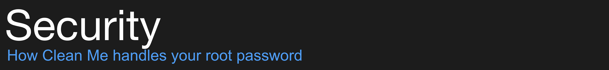
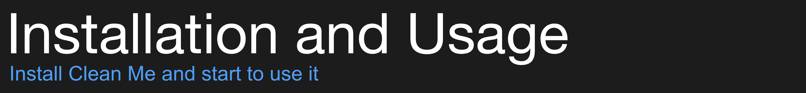

[](https://github.com/Kevin-De-Koninck/Clean-Me/releases)
[](https://github.com/Kevin-De-Koninck/Clean-Me/releases/latest)

<a href="https://ko-fi.com/koninck" title="Donate to this project using Buy Me A Coffee"></a>


A list of all scanned directories can be found [here](https://github.com/Kevin-De-Koninck/Clean-Me/blob/master/Clean%20Me/Paths.swift#L11-L31).


I wrote this app just for fast analysing purposes. the cleaning option was just a handy extra feature.

I do **not** recommend you to delete your cache files. Cache files are what makes your programs load faster and perform tasks faster. If you delete it, the program will not only start slower, but will **regenerate** the cache files again. This will **not** save you some precious space on your disk.  
If you do have a problem and want to delete the cache of some specific programs, I suggest you to click on the folder icon and search for that program and delete it this way.

Large log files can be deleted after inspection. A large log file mostly indicates that a program (or your system) has some problems that need to be resolved.

What I do recommend are also the options that are checked when the app loads: emptying the trash, deleting Xcode derived data and mail attachments (once in a while).



Clean Me uses the pod '[STPrivilegedTask](https://github.com/sveinbjornt/STPrivilegedTask)' to handle sensitive data like getting your root password. Clean Me does not save this password, nor does it load the password in a variable.
If you do not trust Clean Me, then check its code or block all internet access with `Little Snitch` or `RadioSilence`.
Normally Clean Me should **not** request an internet connection, if it does, you app is compromised. In that case, remove the app as soon as possible.

Clean Me also will not delete the directory itself. Only the content of the directory will be cleaned. This is because some programs rely on the existence of the directory. This way, the permissions of the directory will also not change, which is a security baseline.



Clean Me can be installed using `Homebrew cask` or manually via the releases on this GitHub repository.

**Install via Homebrew cask**

You can find it [here](https://formulae.brew.sh/cask/clean-me). Install it as follows:
```
brew cask install clean-me
```
If you notice that the version on cask is outdated, please follow the instructions [here](https://github.com/Homebrew/homebrew-cask/blob/master/CONTRIBUTING.md#updating-a-cask) to update it for everyone,
``` bash
brew install vitorgalvao/tiny-scripts/cask-repair
cask-repair clean-me
```

**Install manually**

Clean Me can be installed like any other macOS app file:
1. Download it [here](https://github.com/Kevin-De-Koninck/Clean-Me/releases/download/v1.4.2/Clean.Me.app.zip)
2. Unzip the file
3. Copy the unzipped file (`Clean me.app`) to you `Applications` directory on your MacBook
4. (Only the first time) In the `Applications` directory, right-click the file and chose `open`
5. Now you can access Clean Me like any other macOS app on your system

**How to use Clean Me**

When you've opened the app, you have 4 options:
- Click the app logo to see some other apps that I can recommend to clean and maintain your mac.
- Click `analyse` to see how much space each topic consumes. This will ask for your administrator's password for scanning the directories that require root. If you do not provide the password, Clean Me will just skip those files for which it requires root and display `0 MB`.
- Click `Clean` to delete all topics that are selected. If a certain topic requires root, it will ask for the root password. Again, if you do not provide the password, it will skip those files.
- Click the little folder icon to open the specific folder which will be cleaned.


To be able to remove iMessage attachments, Clean Me requires full disk access. **DO NOT GRANT THIS IF YOU DO NOT TRUST CLEAN ME.**

To enable full disk access:
1. Pull down the  Apple menu and choose `System Preferences`
2. Choose `Security & Privacy` control panel
3. Now select the `Privacy` tab, then from the left-side menu select `Full Disk Access`
4. Click the lock icon in the lower left corner of the preference panel and authenticate with an admin level login
5. Now click the `[+]` plus button to add the Clean Me app with full disk access
6. Navigate to the `/Applications/Utilities/` folder and choose `Clean Me` to grant Clean Me with Full Disk Access privileges


- [bsharper](https://github.com/bsharper) - see [#1](https://github.com/Kevin-De-Koninck/Clean-Me/issues/1)
- [SMillerDev](https://github.com/SMillerDev) - see [#25](https://github.com/Kevin-De-Koninck/Clean-Me/pull/25)
- [fabianschwarzfritz](https://github.com/fabianschwarzfritz) - see [#30](https://github.com/Kevin-De-Koninck/Clean-Me/pull/30)
